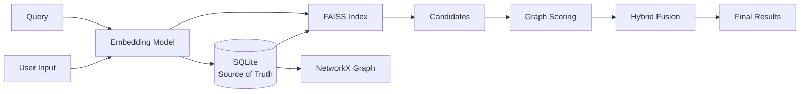

# SageDB: Vector + Graph Native Database

SageDB is a high-performance, hybrid retrieval system built for the hackathon. It combines the semantic power of **FAISS** (Vector Search) with the relational context of **NetworkX** (Graph Traversal), using **SQLite** as the atomic single source of truth.

## 🚀 Key Features

- **Twin-Engine Retrieval**: Seamlessly blends vector similarity and graph connectivity.
- **Late Interaction Fusion**: Configurable Alpha/Beta scoring for hybrid ranking.
- **Concurrency Safe**: Implements Reader-Writer locks for high-throughput read/write operations.
- **Atomic Consistency**: SQLite guarantees data integrity across vector and graph indices.
- **Production Ready**: Includes Pydantic validation, error handling, and benchmarks.

## 🛠️ Tech Stack

- **Core**: Python 3.9+
- **API**: FastAPI, Uvicorn
- **Vector Engine**: FAISS (IndexFlatIP)
- **Graph Engine**: NetworkX
- **Storage**: SQLite
- **Embeddings**: Sentence-Transformers (all-MiniLM-L6-v2)

## 📦 Installation

1. **Clone the repository**
   ```bash
   git clone https://github.com/shivansh023023/SageDB.git
   cd SageDB
   ```

2. **Install Dependencies**
   ```bash
   pip install -r requirements.txt
   ```

## 🏃‍♂️ Running the Server

Start the FastAPI server:
```bash
python main.py
```
The API will be available at `http://localhost:8000`.

## 📚 API Documentation

Visit `http://localhost:8000/docs` for the interactive Swagger UI.

### Key Endpoints

- `POST /v1/nodes`: Create a new node (Atomic write to SQLite + FAISS + Graph).
- `POST /v1/edges`: Connect nodes with weighted relations.
- `POST /v1/search/hybrid`: Perform hybrid vector+graph search.
- `POST /v1/benchmark`: Run automated precision/recall metrics.

## 🧪 Architecture



## ⚖️ License

MIT License
