# SageDB: Vector + Graph Native Database

SageDB is a high-performance, hybrid retrieval system built for the hackathon. It combines the semantic power of **FAISS** (Vector Search) with the relational context of **NetworkX** (Graph Traversal), using **SQLite** as the atomic single source of truth.

## 🚀 Key Features

- **Twin-Engine Retrieval**: Seamlessly blends vector similarity and graph connectivity.
- **Late Interaction Fusion**: Configurable Alpha/Beta scoring for hybrid ranking.
- **Concurrency Safe**: Implements Reader-Writer locks for high-throughput read/write operations.
- **Atomic Consistency**: SQLite guarantees data integrity across vector and graph indices.
- **Production Ready**: Includes Pydantic validation, error handling, and benchmarks.

### 🆕 Scalability Features (v2.0)

| Feature                 | Description                                        | Benefit                                |
| ----------------------- | -------------------------------------------------- | -------------------------------------- |
| **HNSW Index**          | Hierarchical Navigable Small World graph for FAISS | O(log N) search vs O(N) brute-force    |
| **PageRank Centrality** | Graph importance scoring using PageRank algorithm  | Better node ranking than simple degree |
| **GraphML Persistence** | XML-based graph storage format                     | Human-readable, cross-platform, robust |
| **Centrality Caching**  | TTL-based cache for PageRank scores                | Faster repeated queries                |

## 🛠️ Tech Stack

- **Core**: Python 3.9+
- **API**: FastAPI, Uvicorn
- **Vector Engine**: FAISS (IndexHNSWFlat for scalability)
- **Graph Engine**: NetworkX with PageRank
- **Storage**: SQLite + GraphML
- **Embeddings**: Sentence-Transformers (all-MiniLM-L6-v2)

## 📦 Installation

1. **Clone the repository**

   ```bash
   git clone https://github.com/shivansh023023/SageDB.git
   cd SageDB
   ```

2. **Install Dependencies**
   ```bash
   pip install -r requirements.txt
   ```

## 🏃‍♂️ Running the Server

Start the FastAPI server:

```bash
python main.py
```

The API will be available at `http://localhost:8000`.

### Streamlit UI

```bash
streamlit run ui/app.py
```

The UI will be available at `http://localhost:8501`.

## ⚙️ Configuration

All scalability settings can be configured via environment variables or `config.py`:

```python
# FAISS Index Type: "flat" (brute-force) or "hnsw" (approximate)
FAISS_INDEX_TYPE = "hnsw"

# HNSW Parameters
HNSW_M = 32                    # Connections per layer
HNSW_EF_CONSTRUCTION = 200     # Build-time accuracy
HNSW_EF_SEARCH = 64            # Query-time accuracy

# PageRank Settings
PAGERANK_DAMPING = 0.85        # Standard damping factor
CENTRALITY_CACHE_TTL = 300     # Cache TTL in seconds (5 min)
```

## 📚 API Documentation

Visit `http://localhost:8000/docs` for the interactive Swagger UI.

### Key Endpoints

- `POST /v1/nodes`: Create a new node (Atomic write to SQLite + FAISS + Graph).
- `POST /v1/edges`: Connect nodes with weighted relations.
- `POST /v1/search/hybrid`: Perform hybrid vector+graph search.
- `POST /v1/ingest/file`: Ingest documents with automatic chunking.
- `POST /v1/benchmark`: Run automated precision/recall metrics.

## 🧪 Architecture

The following diagram shows SageDB's complete data flow from ingestion to retrieval:

```mermaid
flowchart TB
    subgraph INGESTION["📥 INGESTION PIPELINE"]
        File["📄 Document\n(PDF, TXT, MD)"] --> Chunker["✂️ Semantic Chunker\n(Header-aware)"]
        Chunker --> Chunks["📦 Chunks\n+ Metadata"]
    end

    subgraph STORAGE["💾 TRIPLE STORAGE (Atomic)"]
        Chunks --> SQLite[("🗄️ SQLite\n(Source of Truth)")]
        SQLite --> FAISS["🔍 FAISS\n(HNSW Index)"]
        SQLite --> Graph["🕸️ NetworkX\n(DiGraph)"]
    end

    subgraph RETRIEVAL["🔎 HYBRID RETRIEVAL"]
        Query["🔤 Query"] --> Embed["🧠 Embedding\n(MiniLM-L6-v2)"]
        Embed --> VectorSearch["📐 Vector Search\n(Top-K Seeds)"]
        VectorSearch --> Expand["🌐 Graph Expansion\n(2-hop BFS)"]
        Expand --> PPR["⭐ Personalized\nPageRank"]
        PPR --> Fusion["⚡ Late Fusion\nα·Vector + β·Graph"]
    end

    subgraph OUTPUT["📤 OUTPUT"]
        Fusion --> Dedup["🧹 Deduplication\n(Hash + Semantic)"]
        Dedup --> Results["📊 Ranked Results\n+ Reasoning Trace"]
    end

    FAISS -.-> VectorSearch
    Graph -.-> Expand
    Graph -.-> PPR
```



### Data Flow Explanation

1. **Ingestion**: Documents are split into semantic chunks using header-aware chunking
2. **Storage**: Chunks are atomically written to SQLite (source of truth), then indexed in FAISS (vectors) and NetworkX (graph)
3. **Retrieval**:
   - Query → Embedding → Vector search finds initial "seed" candidates
   - Graph expansion explores 2-hop neighborhood of seeds
   - Personalized PageRank scores nodes based on query relevance
   - Late fusion combines vector similarity (α) with graph importance (β)
4. **Output**: Results are deduplicated and returned with reasoning traces

## 🔬 Scalability Deep Dive

### HNSW Index

The Hierarchical Navigable Small World (HNSW) algorithm creates a multi-layer graph for approximate nearest neighbor search:

- **Complexity**: O(log N) vs O(N) for brute-force
- **Trade-off**: Slight recall loss (~99%) for massive speed gains
- **Best for**: 100K+ vectors

### PageRank Centrality

Instead of simple degree centrality, we use Google's PageRank algorithm:

- **Formula**: PR(A) = (1-d) + d × Σ(PR(T)/C(T))
- **Damping**: 0.85 (probability of following a link)
- **Benefit**: Identifies truly important nodes, not just connected ones

### GraphML Persistence

- Human-readable XML format
- Preserves all node/edge attributes
- No pickle security vulnerabilities
- Cross-platform compatible

## 🚀 Production RAG Features

| Feature                   | Description                                      | Benefit                                 |
| ------------------------- | ------------------------------------------------ | --------------------------------------- |
| **Personalized PageRank** | Query-aware graph scoring                        | Better relevance for structural queries |
| **Query Decomposition**   | Splits complex queries (e.g., "Compare X and Y") | Handles multi-entity questions          |
| **RRF Fusion**            | Reciprocal Rank Fusion for sub-queries           | Prevents garbage dilution               |
| **Search Cache**          | LRU cache with 5-min TTL                         | ~100x faster for repeated queries       |
| **Semantic Dedup**        | Hash + cosine similarity                         | Removes near-duplicates                 |
| **Reasoning Trace**       | Step-by-step retrieval explanation               | Explainable AI for judges               |
| **Streaming Search**      | SSE endpoint for real-time results               | Better UX for large result sets         |

## ⚖️ License

MIT License
